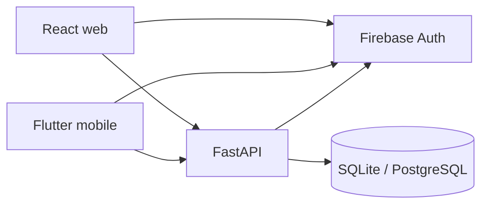

# Pulse Track

Personal workspace for planned work, time logs, goals, and progress charts.

**React (Vite) web app** + **Flutter mobile app** + **FastAPI** backend, with **Firebase Authentication**. Web and mobile share one API and one user data store.

## What it does

| Area | What you get |
|---|---|
| **Board** | Kanban / task list: To Do → In Progress → Done. Optional start/due dates, category, and link to a goal. |
| **Activities** | Time logs against **In Progress** tasks. Edit or delete logs. Sleep logs with Ideal / Normal / Bad quality. |
| **Goals** | Hours target (daily/weekly/monthly) **or** a due date (not both). Optional start date. Link Board tasks. **Complete** or **Failed** (missed deadline). |
| **Dashboard** | Period snapshot: logged time, activity count, time & sleep charts, category mix, goal progress. |
| **Analytics** | Time over time by category, pie mix, breakdown **by task**. |
| **Profile** | Display name, bio, timezone. Mobile also has **Appearance** (Light / Dark / Web themes). |
| **Mobile** | Flutter Android/iOS client with the same product flow and shared API. |

Categories: health, work, entertainment, sleep, others, plus user-defined custom categories.

**Sleep quality:** Ideal (wake 06:00–06:30 and ≥ 7h), Normal (wake 06:30–07:30 and ≥ 7h), or Bad otherwise.

## How the pieces connect



1. Sign in with **Firebase** (Google or email) on web or mobile.
2. Clients send `Authorization: Bearer <Firebase ID token>` on every API call.
3. FastAPI verifies the token, loads/creates the user, and serves **tasks · activities · goals · analytics**.
4. Create **tasks** on the Board → move to **In Progress** → **log time** → track **goals** → review **Dashboard / Analytics**.

Goals count time from linked tasks (category fallback if none linked yet).

**Full diagrams and data flow:** [docs/ARCHITECTURE.md](docs/ARCHITECTURE.md).

## Architecture (summary)

| Choice | Why |
|---|---|
| **React + Vite** | Fast web UI for board, forms, and charts |
| **MUI + Recharts** | Components and pictorial progress (web) |
| **Flutter** | Native Android / iOS with shared product rules |
| **FastAPI** | Typed REST API, OpenAPI at `/docs` |
| **Firebase Auth** | Google + email/password; no passwords stored in this app |
| **SQLite / PostgreSQL** | Local SQLite; RDS PostgreSQL on AWS |

### Auth flow

1. Sign in (web `/login` or mobile login screen).
2. Client holds a Firebase ID token.
3. API calls send `Authorization: Bearer <token>`.
4. FastAPI verifies via Firebase Admin SDK, then loads/creates `users` by `firebase_uid`.
5. All data is scoped to that user.

Use **http://localhost:5173** for local web (not mixed with `127.0.0.1`) so the auth session stays on one origin.

Optional local-only skip: backend `DEV_SKIP_AUTH=true` + `Bearer dev:<uid>`. Never enable in production.

## Project layout

```text
pulse-track/
  backend/     FastAPI app, SQLite locally / PostgreSQL on AWS
  frontend/    React + Vite web app
  mobile/      Flutter Android / iOS client
  docs/        Architecture, deploy, UI, mobile specs
```

## Documentation

| Doc | Contents |
|-----|----------|
| [docs/ARCHITECTURE.md](docs/ARCHITECTURE.md) | **System architecture** — web, mobile, backend, auth, data, environments |
| [docs/DEPLOY-AWS.md](docs/DEPLOY-AWS.md) | AWS deploy (S3/CloudFront, ECS/App Runner, RDS) |
| [docs/UI-ABILITIES.md](docs/UI-ABILITIES.md) | Web UI capabilities |
| [docs/MOBILE.md](docs/MOBILE.md) | Mobile product documentation |
| [docs/MOBILE-UI-SPEC.md](docs/MOBILE-UI-SPEC.md) | Mobile / API field contracts |
| [mobile/README.md](mobile/README.md) | Run, APK build, Firebase, API defines |
| [frontend/README.md](frontend/README.md) | Web app run / env notes |

## Deploy on AWS

Web and mobile share one HTTPS API and one PostgreSQL database. Follow [docs/DEPLOY-AWS.md](docs/DEPLOY-AWS.md). Pushes to `master` can deploy via GitHub Actions (ECR + ECS, optional S3/CloudFront).

```text
Browser ──► CloudFront ──► S3 (React)
                │
Mobile ─────────┼──► FastAPI (ECS / App Runner) ──► RDS
                │              │
                └──────── Firebase Admin (verify token)
```

## Run locally

### Backend

```powershell
cd backend
python -m venv .venv
.\.venv\Scripts\Activate.ps1
pip install -r requirements.txt
copy .env.example .env
.\.venv\Scripts\python.exe -m uvicorn app.main:app --reload --port 8000
```

- API: http://127.0.0.1:8000
- Health: http://127.0.0.1:8000/api/health
- Swagger UI: http://127.0.0.1:8000/docs
- ReDoc: http://127.0.0.1:8000/redoc
- OpenAPI JSON: http://127.0.0.1:8000/openapi.json

### Frontend

```powershell
cd frontend
copy .env.example .env
npm install
npm run dev
```

App: http://localhost:5173

Fill `frontend/.env` with Firebase web config (`VITE_FIREBASE_*`) and `VITE_API_URL=http://127.0.0.1:8000`.

### Mobile (Flutter)

```powershell
# Optional: tunnel local API into Android emulator
adb reverse tcp:8000 tcp:8000

cd mobile
flutter pub get
flutter run
```

Uses the **same Firebase project** as the web app. On startup the app probes local `http://127.0.0.1:8000`; if unreachable it uses the **deployed API**.

Build an APK for a physical phone:

```powershell
cd mobile
flutter build apk --release --split-per-abi
adb install -r build\app\outputs\flutter-apk\app-arm64-v8a-release.apk
```

Details: [docs/MOBILE.md](docs/MOBILE.md) · [mobile/README.md](mobile/README.md) · [docs/ARCHITECTURE.md](docs/ARCHITECTURE.md).

Optional local demo auth: `flutter run --dart-define=USE_DEV_AUTH=true` (requires backend `DEV_SKIP_AUTH=true`).

## Enable Firebase Auth

1. Create a Firebase project.
2. **Authentication → Sign-in method** — enable **Google** and **Email/Password**.
3. Add a **Web app** and copy config into `frontend/.env`.
4. Add `localhost` (and `127.0.0.1` if you use it) under **Authorized domains**.
5. Backend: download a service account key as `backend/firebase-service-account.json`, **or** fill `FIREBASE_*` in `backend/.env`.
6. Keep `DEV_SKIP_AUTH=false` for real sign-in.
7. Mobile: Android app + SHA-1 + `google-services.json` (see [mobile/README.md](mobile/README.md)).

Allow popups for localhost if Google sign-in is blocked in the browser.

## Main API

| Resource | Endpoints |
|---|---|
| Users | `GET/PATCH /api/users/me` |
| Tasks | `GET/POST /api/tasks`, `GET/PATCH/DELETE /api/tasks/{id}` |
| Activities | `GET/POST /api/activities`, `GET/PATCH/DELETE /api/activities/{id}` |
| Goals | `GET/POST /api/goals`, `PATCH/DELETE /api/goals/{id}` |
| Analytics | `GET /api/analytics/summary?period=day\|week\|month\|year\|custom` |

Analytics returns total minutes, category breakdown, **task breakdown**, time series, **sleep over time** (minutes + quality per day), and active goal progress. Custom ranges use `start_date` / `end_date`.
