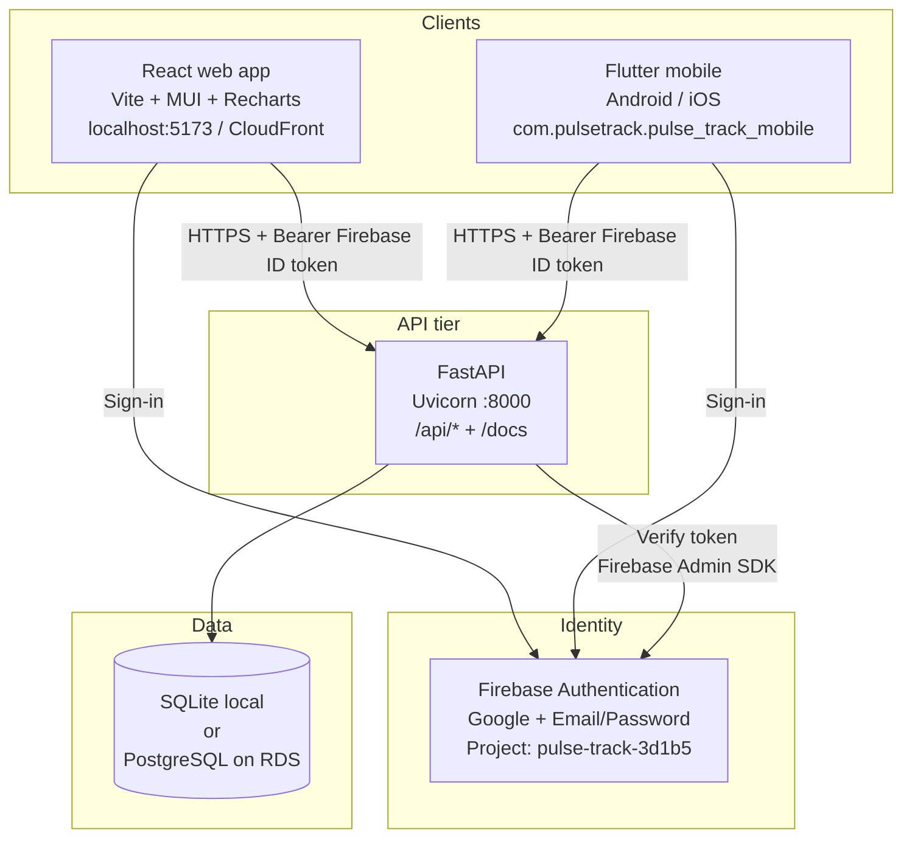
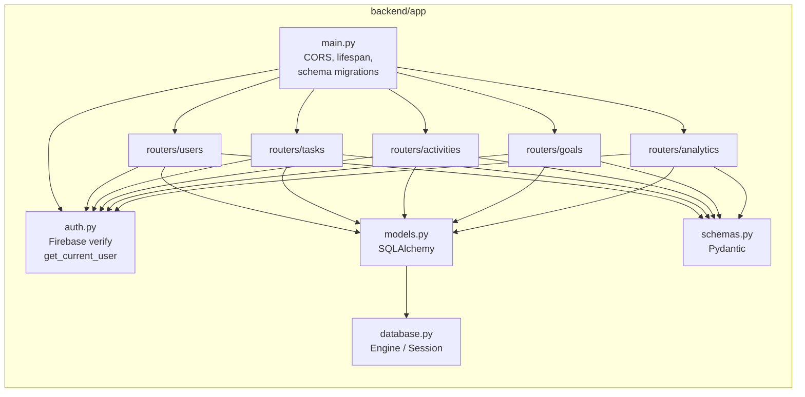
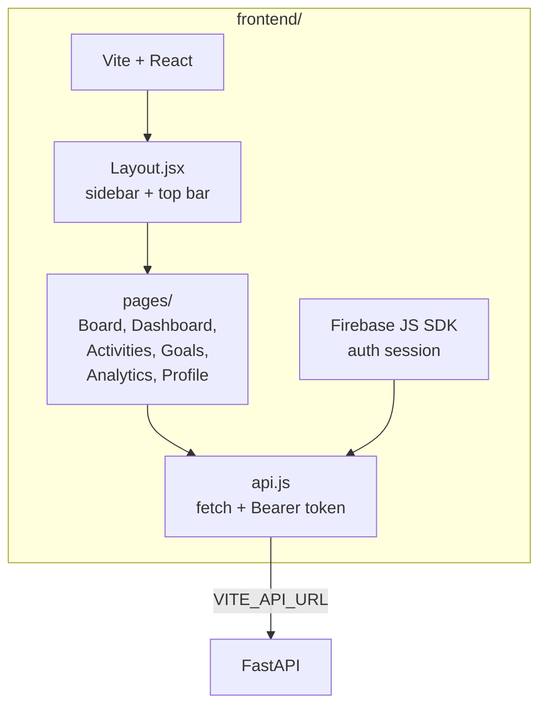
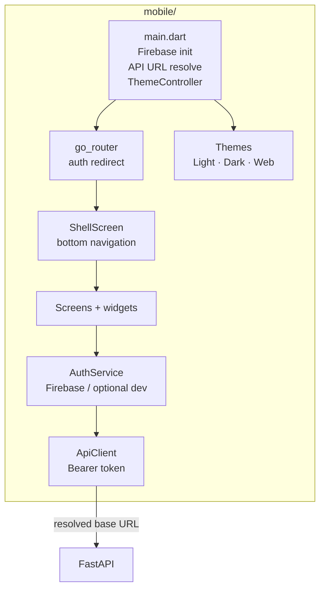
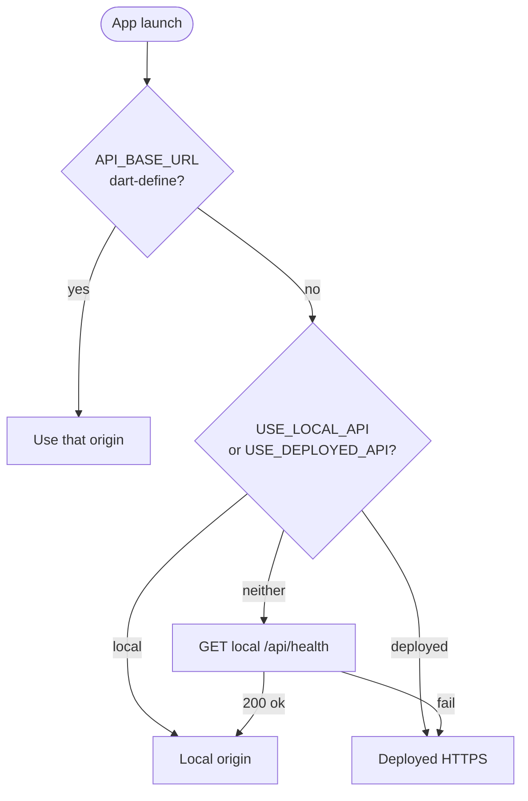
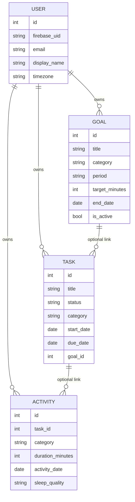
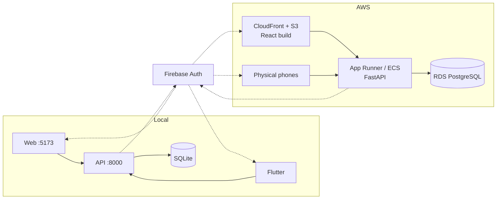

# Pulse Track — System Architecture

How the **web frontend**, **Flutter mobile app**, and **FastAPI backend** connect, authenticate, and share data.

| Related docs | |
|---|---|
| Root overview | [README.md](../README.md) |
| AWS deployment | [DEPLOY-AWS.md](./DEPLOY-AWS.md) |
| Mobile product | [MOBILE.md](./MOBILE.md) |
| Mobile API contracts | [MOBILE-UI-SPEC.md](./MOBILE-UI-SPEC.md) |
| Web UI abilities | [UI-ABILITIES.md](./UI-ABILITIES.md) |

---

## 1. High-level system

Three clients share **one REST API** and **one user database**. Identity is centralized in **Firebase Auth**.



### What each piece owns

| Layer | Responsibility |
|-------|----------------|
| **Web** | Browser UX: Kanban board, forms, charts |
| **Mobile** | Native UX: bottom tabs, sheets, themes (Light / Dark / Web), APK builds |
| **Backend** | Auth verification, CRUD, analytics aggregation, schema bootstrap |
| **Firebase** | User accounts and ID tokens only (no app business data) |
| **Database** | Users, tasks, activities, goals — scoped by `user_id` |

Web and mobile **do not talk to each other**. Both call the same API; data stays consistent per signed-in Firebase user.

---

## 2. Request path (authenticated call)

```mermaid
sequenceDiagram
  participant U as User
  participant C as Client<br/>(Web or Mobile)
  participant F as Firebase Auth
  participant A as FastAPI
  participant D as Database

  U->>C: Open app / sign in
  C->>F: Google or email/password
  F-->>C: Firebase ID token
  C->>A: GET/POST /api/...<br/>Authorization: Bearer &lt;token&gt;
  A->>F: Verify ID token (Admin SDK)
  F-->>A: uid, email, name
  A->>D: Find or create users row<br/>by firebase_uid
  A->>D: Query/mutate user-scoped data
  D-->>A: Rows
  A-->>C: JSON response
  C-->>U: Updated UI
```

**Rules**

- Every protected route requires `Authorization: Bearer <token>`.
- First successful call **auto-provisions** a `users` row from Firebase claims.
- Tasks, activities, goals, and analytics are always filtered by that user.
- Optional local-only bypass: backend `DEV_SKIP_AUTH=true` + `Bearer dev:<uid>` (never in production).

---

## 3. Backend architecture



### API surface

| Prefix | Resources |
|--------|-----------|
| `GET /api/health` | Liveness (`status`, `service`) — no auth |
| `/api/users` | `GET/PATCH /me` |
| `/api/tasks` | CRUD + status (`todo` / `in_progress` / `completed`) |
| `/api/activities` | CRUD; sleep fields; only **In Progress** tasks |
| `/api/goals` | CRUD; hours or deadline; complete / fail |
| `/api/analytics` | `GET /summary?period=…&start_date=&end_date=` |

Interactive docs: `{API}/docs`, `{API}/redoc`, `{API}/openapi.json`.

### Analytics periods

| `period` | Range |
|----------|--------|
| `day` | Today |
| `week` | Monday → today |
| `month` | 1st of month → today |
| `year` | Jan 1 → today |
| `custom` | Explicit `start_date` + `end_date` (used by mobile “30 days” and “By month”) |

---

## 4. Web frontend architecture



| Concern | Location |
|---------|----------|
| Env | `frontend/.env` — `VITE_API_URL`, `VITE_FIREBASE_*` |
| Charts | Recharts on Dashboard / Analytics |
| Theme | Dark navy + cyan CSS tokens (`index.css`) |
| OpenAPI | Backend only: `{API}/docs`, `/redoc`, `/openapi.json` |

Local origin should stay **`http://localhost:5173`** so Firebase session cookies stay on one host.

---

## 5. Mobile architecture



### API base URL resolution



Defaults (overridable with `--dart-define`):

| Role | Default |
|------|---------|
| Local | `http://127.0.0.1:8000` |
| Deployed | `https://pu-33c5978573c14366842f5c7087cb4002.ecs.us-east-1.on.aws` |

Emulator tip: `adb reverse tcp:8000 tcp:8000` so `127.0.0.1:8000` reaches the host backend.

### Appearance themes (mobile)

| Theme | Look |
|-------|------|
| **Light** | White surfaces, corporate blue `#2563EB` |
| **Dark** | Black / near-black surfaces, soft blue accents |
| **Web** | Navy canvas + cyan accents (aligned with web CSS) |

Stored on-device (`SharedPreferences` key `theme_style`). Switch under **Profile → Appearance**.

---

## 6. Domain model (shared)



**Product rules (enforced by API + both UIs)**

- Time logs only against tasks in **`in_progress`**.
- Sleep quality: Ideal / Normal / Bad from wake window + duration (≥ 7h for Ideal/Normal).
- Goals are **hours** (daily/weekly/monthly) **or** **deadline** — not both.
- Missed deadline goals become **Failed** and are not editable.

---

## 7. Environments



| Environment | Web | Mobile | API | DB |
|-------------|-----|--------|-----|-----|
| Local | Vite | Emulator / USB | uvicorn | SQLite |
| AWS | S3 + CloudFront | Store / sideload APK | App Runner / ECS | RDS PostgreSQL |

Deploy details: [DEPLOY-AWS.md](./DEPLOY-AWS.md).

---

## 8. Repository map

```text
pulse-track/
├── backend/                 # FastAPI
│   └── app/
│       ├── main.py
│       ├── auth.py
│       ├── models.py
│       ├── schemas.py
│       ├── database.py
│       └── routers/         # users, tasks, activities, goals, analytics
├── frontend/                # React + Vite web
│   └── src/
│       ├── api.js
│       ├── pages/
│       └── components/
├── mobile/                  # Flutter
│   └── lib/
│       ├── config/
│       ├── services/
│       ├── screens/
│       ├── theme/           # Light / Dark / Web
│       └── widgets/
└── docs/
    ├── ARCHITECTURE.md      # this file
    ├── DEPLOY-AWS.md
    ├── MOBILE.md
    ├── MOBILE-UI-SPEC.md
    └── UI-ABILITIES.md
```

---

## 9. Security notes

- Firebase ID tokens are short-lived; clients refresh them; API verifies on every request.
- Do not commit service account JSON or `.env` secrets.
- `DEV_SKIP_AUTH` must remain **false** in AWS.
- CORS is configured for the web origin(s); native mobile apps are not subject to CORS.
