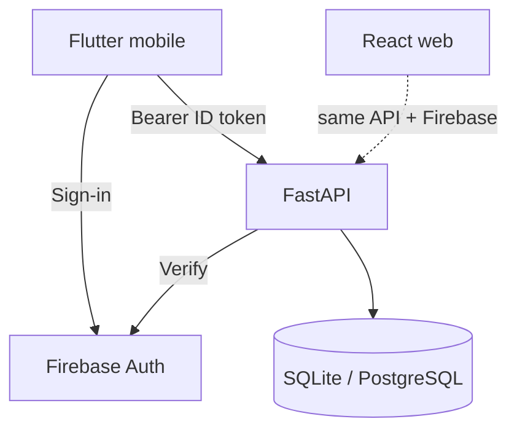

# Pulse Track — Mobile Application

Flutter client for **Android** and **iOS**. It uses the **same FastAPI backend**, **Firebase Auth project**, categories, sleep rules, and user data as the web app.

| Related docs | |
|---|---|
| **System architecture** (diagrams) | [ARCHITECTURE.md](./ARCHITECTURE.md) |
| Developer runbook (build, run, APK, Firebase) | [mobile/README.md](../mobile/README.md) |
| API contracts & validation | [MOBILE-UI-SPEC.md](./MOBILE-UI-SPEC.md) |
| Web UI abilities | [UI-ABILITIES.md](./UI-ABILITIES.md) |
| AWS deploy (shared API) | [DEPLOY-AWS.md](./DEPLOY-AWS.md) |

---

## Purpose

Give users a native phone experience for:

1. Planning work on the **Board**
2. Logging time in **Activities** (including sleep)
3. Tracking **Goals**
4. Reviewing progress on **Dashboard** and **Analytics**
5. Managing **Profile** and **Appearance** (themes)

Web and mobile stay in sync because both talk to one authenticated API.

---

## Architecture

Mobile is one of two API clients. Identity and data live outside the app binary:



Details (sequence diagrams, URL resolution, domain model): **[ARCHITECTURE.md](./ARCHITECTURE.md)**.

| Concern | Behavior |
|---------|----------|
| **Auth** | Firebase Google + email/password (optional `USE_DEV_AUTH` for demos) |
| **API** | Probe local `http://127.0.0.1:8000`; else **deployed HTTPS** |
| **CORS** | Not required for native apps |
| **Package id** | `com.pulsetrack.pulse_track_mobile` |
| **Themes** | Light · Dark · Web — Profile → Appearance |

---

## Feature parity with web

| Area | Mobile | Web-only |
|------|--------|----------|
| Board CRUD + status + goal link | Yes (filter pills + vertical list) | Drag-and-drop Kanban |
| Activities CRUD + filters + sleep | Yes | Richer filter grid |
| Goals hours/deadline + tasks + complete | Yes | Same core |
| Dashboard charts + goal progress | Yes — Day / Week / **30 days** / **By month** | Day / Week / Month / Year |
| Analytics | Yes — same ranges + **Year**; stacked/line charts | Same core |
| Appearance themes | Light / Dark / Web | CSS navy+cyan only |
| Profile | Yes | Same core |
| API Docs (Swagger) | No — use web or `/docs` | Yes |
| Login / register | Single screen with toggle | Separate routes |

Business rules (In Progress–only logging, sleep Ideal/Normal/Bad, goal failed state, categories) match the web and backend.

---

## Screens

### Login

- Brand: pulse-wave logo + **Pulse Track** wordmark
- **Continue with Google**
- Email / password (Sign In or Create account)
- Forgot password (Firebase reset email)

### Shell

Bottom navigation:

1. Board  
2. Dashboard  
3. Activities  
4. Goals  
5. Analytics  
6. Profile  

### Board

- Info banner: only **In Progress** tasks can be logged in Activities
- Status **filter pills** with counts: To Do · In Progress · Done
- **Vertical** list of task cards for the selected status
- Card content: `PT-{id}`, category chip, title, due date, activity stats (`Nh Nm`), linked goal
- **Left border** color matches the task category
- Circular **+** creates a task; tap card to edit
- No per-card status action buttons (status changed in the edit sheet)

### Activities

- Header: **Activities** + circular **+** (same as Board)
- Summary: `Logged N activities · {formatDuration} total` (e.g. `165h 7m`)
- Filters: Search · Category · Date
- Cards: `PT-id · date`, category chip, title, notes snippet, duration badge
- Create/edit: In Progress task only; sleep uses start/wake times and always sends `duration_minutes`

### Goals

- Create/edit: title, category, **hours** (daily/weekly/monthly + target) or **deadline** (`period: deadline` + end date)
- Link multiple Board tasks by category
- Progress bars, complete, delete
- Optional log-time shortcut for linked In Progress tasks

### Dashboard

- Period pills: **Day · Week · 30 days · By month** (month picker)
- Stats tiles: logged time, activities, categories, goals
- **Time** and **Sleep** bar charts (Y-axis, grid, tooltips)
  - Sleep bars colored by Ideal / Normal / Bad
  - 30 days = rolling window; By month = selected calendar month
- Category mix list, goal progress

### Analytics

- Period pills: **Day · Week · 30 days · By month · Year**
- Category pie + legend
- **Time over time** — line chart or stacked bars (year = monthly stacks)
- By-task bars with %

### Profile

- Email (read-only), display name, timezone, bio
- **Appearance:** Light / Dark / Web theme picker (persisted on device)
- Save via `PATCH /api/users/me`
- Sign out
- Debug: resolved API URL, health, Firebase project

---

## Shared constants

### Categories

Health, Learning, Work, Sleep, Entertainment, Personal Technical Projects, AI Content Generation, Others — colors in `mobile/lib/constants/categories.dart` (aligned with `frontend/src/constants.js`).

### Sleep quality

| Quality | Rule |
|---------|------|
| Ideal | Wake 06:00–06:30 and duration ≥ 7h |
| Normal | Wake 06:30–07:30 and duration ≥ 7h |
| Bad | Everything else |

### Task status

`todo` → To Do · `in_progress` → In Progress · `completed` → Done

---

## Branding & themes

| Theme | Description |
|-------|-------------|
| **Light** | White surfaces, primary blue `#2563EB` |
| **Dark** | Black / charcoal surfaces, soft blue accents |
| **Web** | Navy canvas + cyan accents (matches web UI) |

- Circular pulse / ECG logo on login, app bars, and Android launcher
- Tokens: `lib/theme/pulse_palette.dart`, `ThemeController`, `AppTheme.build`
- Assets: `mobile/assets/images/`; vector mark: `BrandLogo` in `lib/widgets/brand.dart`
- Theme / asset changes need a **full app restart** (not only hot reload)

---

## Building for phones

See [mobile/README.md](../mobile/README.md#install-on-a-physical-android-phone).

```powershell
cd mobile
flutter build apk --release --split-per-abi
adb install -r build\app\outputs\flutter-apk\app-arm64-v8a-release.apk
```

On a physical device the app typically uses the **deployed API** (local probe fails). Confirm under Profile → API.

---

## Implementation map

| Concern | Path |
|---------|------|
| Entry + API resolve + themes | `mobile/lib/main.dart`, `config/app_config.dart`, `theme/` |
| Auth | `services/auth_service.dart` |
| HTTP | `services/api_client.dart` |
| Screens | `screens/*.dart` |
| Charts | `widgets/chart_series.dart`, dashboard/analytics screens |
| Period controls | `widgets/analytics_period.dart` |
| Android Firebase | `android/app/google-services.json` |

---

## What mobile does not do

- No in-app admin / multi-user management  
- No offline-first sync queue (online API required)  
- No embedded Swagger UI  
- No Kanban drag-and-drop (status via edit form + filter pills)
